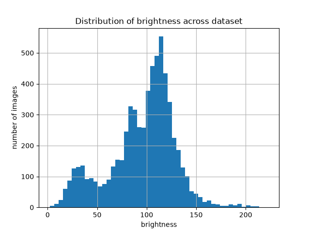
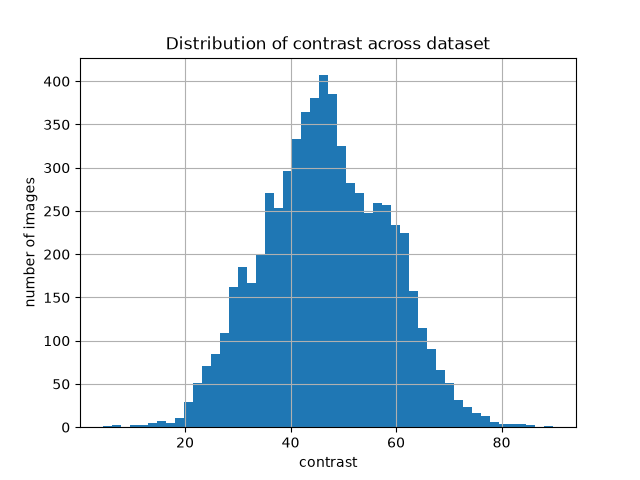
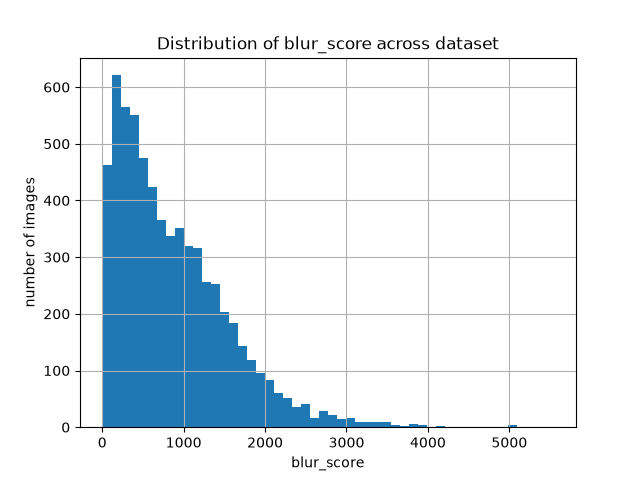

# Aerial-Imagery-Analysis-Calibration-Pipeline

This Project is a simple data-analysis pipeline for aerial drone imagery. It ingests a dataset of aerial images, computes statistical metrics, detects anomalies, goes through deep learning feature, groups and searches images by visual similarities, normalizes exposures and finally presents the output in a dashboard.

Built on the VisDrone aerial imagery dataset(6471 images)


# What it does
- Statistical analysis & data mining: computes brightness, contrast, and blur metrics per image. Detects anomalies in images using z-score with Isolation Forest.

- Deep-learning features: we attract 512-dimensional embeddings from every image using the pretrained model: ResNet18 with IMAGENET1K_V1 as weight. While ignorning the final layer of resnet18

- Clustering & similarity search: groups embedded images into n clusters using the kmeans algorithm to find visually similar images

- Camera & image calibration: corrects lens distortion (checkboard calibration - still working on it[ ]) and normalizes uneven exposures with the CLAHE image processing aglorithm

- Database & Dashboard: stores all results in SQLite database and presents them through a Streamlit dashboard

# Architecture
The pipeline is organized into 6stages, with data flowing from [S1] ingestion through [S2 - S4] analysis into [S5] storage and [S6] presentation

```text
                                [S2] Statistic     
Raw Images -> [S1] Ingestion -> [S3] Deep Learning -> [S5] Database -> [S6] Dashboard
                                [S4] Calibration
```                                

# Key Results

Computed statistics of all 6471 images:
stats:
```text
        brightness     contrast   blur_score
count  6471.000000  6471.000000  6471.000000
mean     95.671978    46.679768   869.646464
std      33.418751    11.787568   686.706490
min       2.080572     4.364025     3.842206
25%      79.053144    38.556883   330.349190
50%     102.814884    46.390540   709.658049
75%     117.096623    55.207880  1249.778823
max     222.629989    89.833314  5541.826009
```
<table>
  <tr>
    <td></td>
    <td></td>
    <td></td>
  </tr>
  <tr>
    <td align="center">Brightness</td>
    <td align="center">Contrast</td>
    <td align="center">Blur score</td>
  </tr>
</table>

Outliers: 
  from 6471 images we have total 187 outliers. 
  122 detected in zscore and 65 detected in ironforest.
  While in zscore 19 detected in brightness, 18 in contrast and 85 in blur score.

Clusters size:
  extracted embeddings have each a length of 512 for the full dataset; kmeans produces n_cluster for randomstate 42. We chose n=8 well distributed visuals clusters with size ranging from 658 - 1059

Calibration result:
  exposure normalization CLAHE reduced lightting induced embedding drift by around 11% on average, consistent in 894 of 1000 tests
 
# Tech Stack
Python, OpenCV, Pytorch(ResNet18), scikit-learn, pandas, NumPy, SQLAlchemy + SQLite, Streamlit


# Project Structure
```text
docs/                           
src/
  s1_datascan/                  scanning
  s2_statistics_data_mining     image statistics, outlier
  s3_deep_learning_features     embedding extraction, clustering
  s4_calibration                undistortion, exposure normalization
  s5_storage                    database, ingestion
  s6_output                     dashboard
/run_pipeline.py                runs full pipeline
```


# How to Run

```bash

#1.
python3 -m venv .venv
source .venv/bin/active
pip install -r requirements.txt


#2.
  # 1. Download the VisDrone2019-DET training set from:
  #   https://github.com/VisDrone/VisDrone-Dataset
  # 2. Unzip it into the `data/` folder so the structure looks like:
  #   data/VisDrone2019-DET-train/images/*.jpg
  #   data/VisDrone2019-DET-train/annotations/*.txt

#3. extract embeddings (one-time: taking around 10min)
python -m src.deep_learning_features.image_classification

#4. run full pipeline
python -m src.run_pipeline

#5. launch dashboard
python -m streamlit run src/s6_output/dashboard.py
``` 


## Data sources & acknowledgements

- **VisDrone dataset** — aerial imagery used throughout this project. Provided by the
  AISKYEYE team at the Lab of Machine Learning and Data Mining, Tianjin University.
  Project: https://github.com/VisDrone/VisDrone-Dataset

- **Camera calibration reference images** — checkerboard images from
  paulmelis/opencv-camera-calibration (https://github.com/paulmelis/opencv-camera-calibration),
  used to demonstrate lens distortion correction.